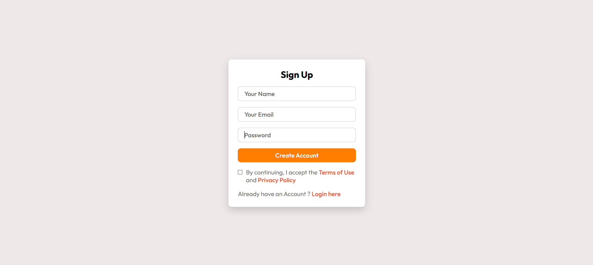
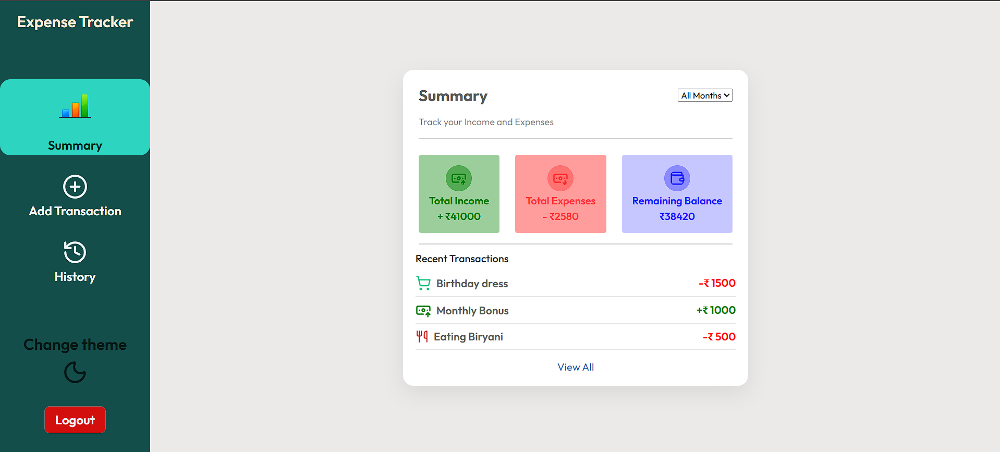
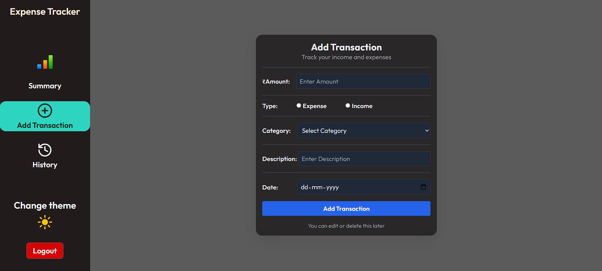
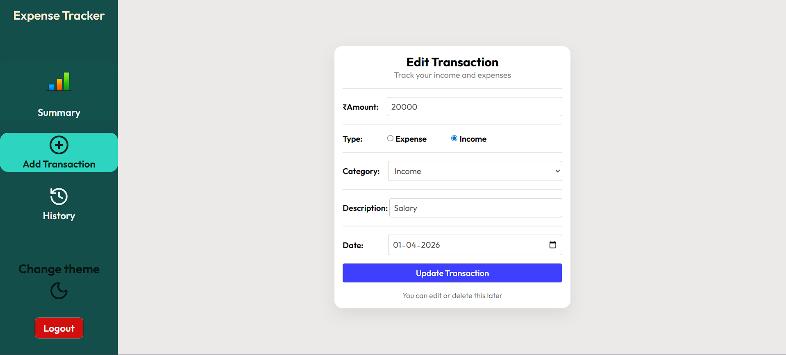
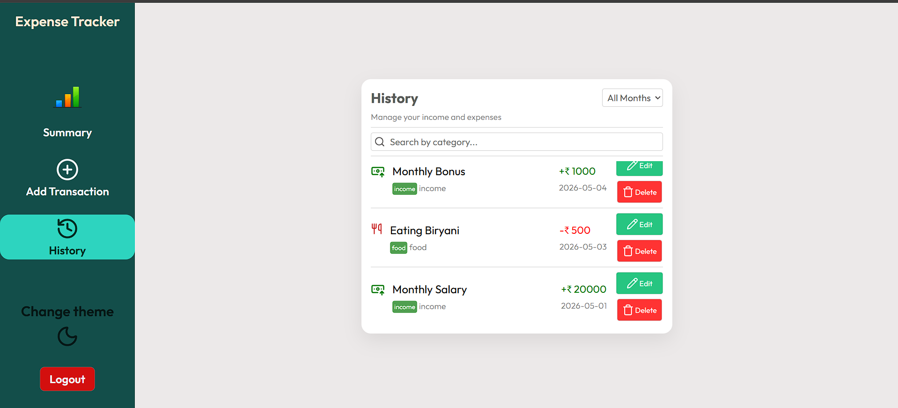

# Expense Tracker 💰

A full-stack expense tracking web application that allows users to manage income and expenses securely with authentication and persistent cloud database storage.

Users can create an account, log in securely, and perform complete transaction management including adding, editing, deleting, searching, and filtering transactions.

---

# 🚀 Features

- 🔐 User Authentication (Signup & Login)
- 🛡️ JWT-based Protected Routes
- ➕ Add income and expense transactions
- ✏️ Edit existing transactions
- 🗑️ Delete transactions
- 🔍 Search transactions by category/description
- 📅 Filter transactions by month
- 📊 Transaction history tracking
- 💾 Persistent cloud database storage using MongoDB
- 🎨 Responsive design (mobile, tablet, desktop)
- 🌗 Light & dark theme support
- 🧠 Centralized state management using Context API
- 🔄 Full frontend-backend integration using REST APIs

---

# 🛠️ Tech Stack

## Frontend
- React (Hooks)
- Context API
- React Router
- Axios
- CSS + Media Queries

## Backend
- Node.js
- Express.js
- JWT Authentication

## Database
- MongoDB Atlas
- Mongoose

## Other Tools
- Git & GitHub
- Postman

---

# 🔐 Authentication Flow

- Users authenticate using email and password
- JWT token is generated on successful login
- Protected API routes verify token using middleware
- Transactions are user-specific and securely isolated

---

# 📂 Project Structure

```bash
frontend/
backend/
```

---

# ⚡ API Endpoints

| Method | Endpoint | Description |
|---|---|---|
| POST | `/api/user/signup` | Register user |
| POST | `/api/user/login` | Login user |
| GET | `/api/transaction` | Get all transactions |
| POST | `/api/transaction` | Add transaction |
| PUT | `/api/transaction/:id` | Edit transaction |
| DELETE | `/api/transaction/:id` | Delete transaction |

---

# 📸 Screenshots

## Signup Page



---

## Summary Page



---

## Add Transaction Page



---

## Edit Transaction



---

## Transaction History Page



# 🌟 Future Improvements

- Data visualization charts
- Export transactions
- Pagination
- Budget tracking
- Email verification
- Password reset

---

# 📌 Learning Outcomes

This project helped in understanding:

- Full-stack application architecture
- REST API design
- JWT authentication & authorization
- MongoDB database operations
- React state management
- Protected routes
- Frontend-backend integration
- CRUD operations
