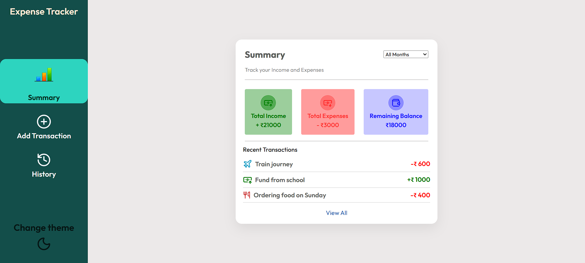
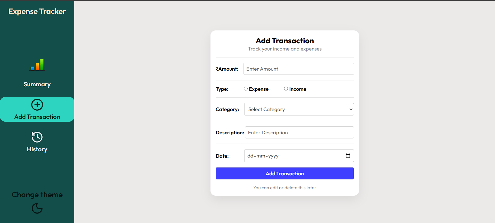
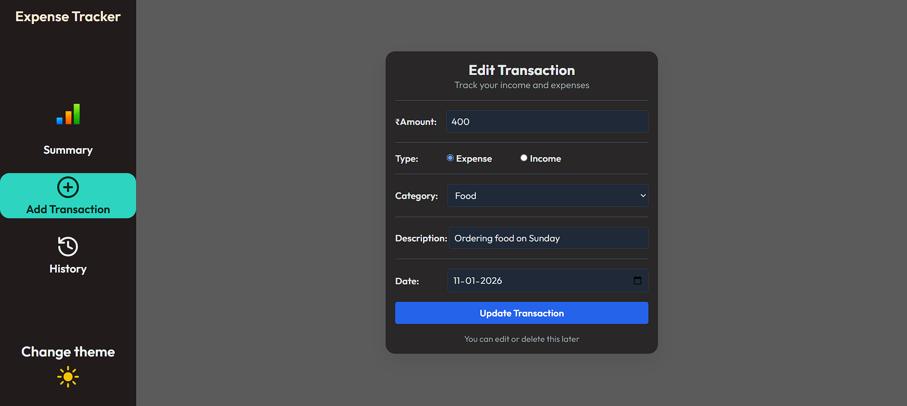
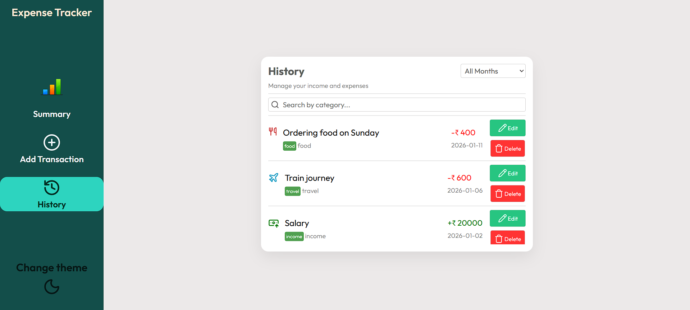
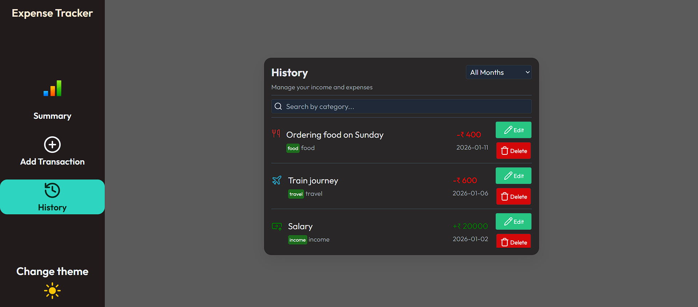

# Expense Tracker 💰

A responsive expense tracking web application built with **React** that allows users to manage their income and expenses efficiently.  
The app supports adding, editing, deleting, and filtering transactions with persistent storage.

---

## 🚀 Features

- ➕ Add income and expense transactions  
- ✏️ Edit existing transactions  
- 🗑️ Delete transactions  
- 🔍 Search transactions by description  
- 📅 Filter transactions by month  
- 💾 Persistent data storage using `localStorage`  
- 🎨 Responsive design (mobile, tablet, desktop)  
- 🌗 Light & dark theme support  
- 🧠 Centralized state management using Context API  

---

## 📸 Screenshots

### 📊 Summary

### ➕ Add Transaction

### ✏️ Edit Transaction

### 📜 History

### 🌙 Dark Mode

## 🛠️ Tech Stack

- **Frontend:** React (Hooks)
- **State Management:** Context API
- **Routing:** React Router
- **Styling:** CSS + Media Queries
- **Storage:** Browser `localStorage`
- **Version Control:** Git & GitHub
